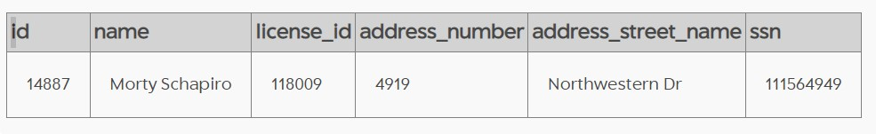
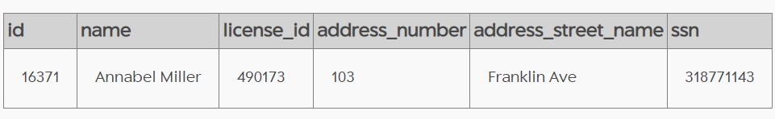
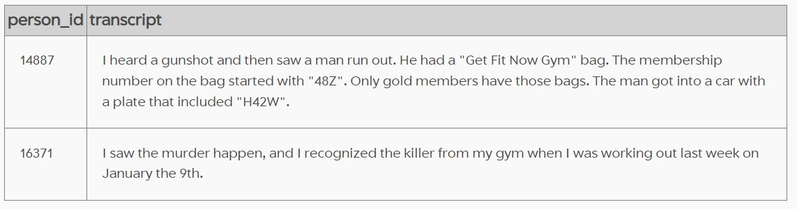
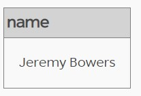
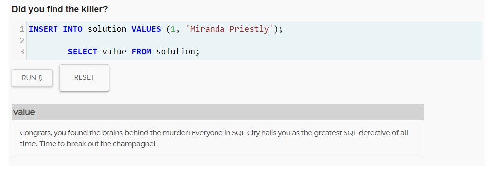
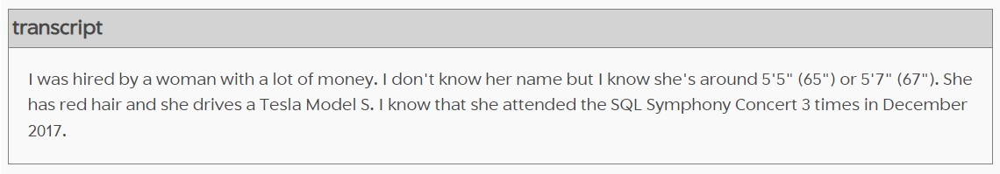
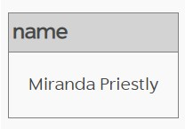
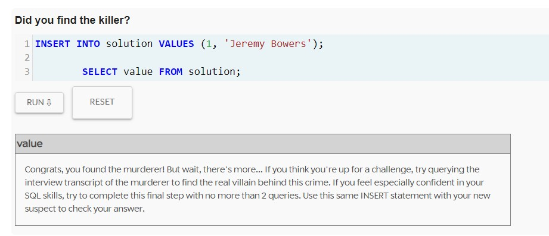

# SQL murder mystery

I have solved the SQL Murder Mystery presented by knightlab (https://mystery.knightlab.com/). This has been such a fun way if practising SQL queries, getting more comfortable with joins, and, last but not least, solving a mystery!

This is a walkthrough on how I solved the challenge:

We know that a murder took place in SQL City on 15th January 2018. Firstly, I had a look at the crime scene report for the specific time and place. This is how I got information about 2 people who witnessed the crime.

```SQL
SELECT * 
 FROM crime_scene_report
WHERE date = 20180115
 AND type = 'murder'
 AND city = 'SQL City';
 ```
 

Using the information returned from the query, I continued by finding out more details about the witnesses.

```SQL
SELECT * 
 FROM person
WHERE address_street_name = 'Northwestern Dr'
ORDER BY address_number DESC
LIMIT 1;
```


```SQL
SELECT * 
 FROM person
WHERE name LIKE '%Annabel%'
 AND address_street_name = 'Franklin Ave';
```


Using their ids, I went forward to discover what precious information they disclosed during their interviews:

```SQL
SELECT * 
 FROM interview 
WHERE person_id IN ( 14887, 16371);
```


Now we know that our killer is a man who is gold member with the ‘Get Fit Now’ Gym and was at the gym on 19th January. We know part of his membership number, and we have a partial plate. Having found out this, I decided I have enough information to go and look for the killer by joining multiple tables:

•	get_fit_now_member contains information about membership number and status 

•	drivers_license contains personal and license information like: gender and car plate number

•	get_fit_now_check_in tells us when each member visited the gym

•	finally, in order to be able join the drivers_licence table with the get_fit_now_member I used the person table (the middle man 😎)

```SQL
SELECT m.name 
 FROM get_fit_now_member m
 INNER JOIN person p
 ON m.person_id = p.id
 INNER JOIN drivers_license dl
 ON p.license_id = dl.id
 INNER JOIN get_fit_now_check_in mci
 ON m.id = mci.membership_id
WHERE dl.gender = 'male'
 AND dl.plate_number LIKE '%H42W%'
 AND m.id LIKE '48Z%'
 AND m.membership_status IN ('gold')
 AND mci.check_in_date = 20180109;
 ```
 
 
 I checked my solution and, ta-daa:
 
 
 
 Hmm, it looks like there was a mastermind behind the murder 🤔. Let’s find out more by seeing what Jeremy Bowers had to say in his interview:
 
 ```SQL
SELECT i.transcript 
 FROM interview i
 INNER JOIN person p
 ON i.person_id = p.id
WHERE name = 'Jeremy Bowers';
```


To get the hang of this we have to look in different tables again:

•	drivers_license contains personal and license information like: gender, height, hair color, car make and model

•	facebook_event_check_in tells us who attended different events

•	and, finally, to find out the woman’s name, I also joined the person table


```SQL
SELECT DISTINCT p.name 
 FROM person p
 INNER JOIN drivers_license dl
 ON p.license_id = dl.id
 INNER JOIN facebook_event_checkin fci
 ON p.id = fci.person_id
WHERE dl.car_make = 'Tesla'
 AND dl.car_model = 'Model S'
 AND dl.gender = 'female'
 AND dl.hair_color = 'red'
 AND dl.height BETWEEN 65 AND 67
 AND p.id IN (
            SELECT person_id 
             FROM facebook_event_checkin
            WHERE event_name = 'SQL Symphony Concert'
             AND date LIKE '201712%'
            GROUP BY person_id
            HAVING COUNT(event_id) = 3);
  ```
  
  
  I checked my solution 🥁
  
  
  
  Murder mystery solved!


 
