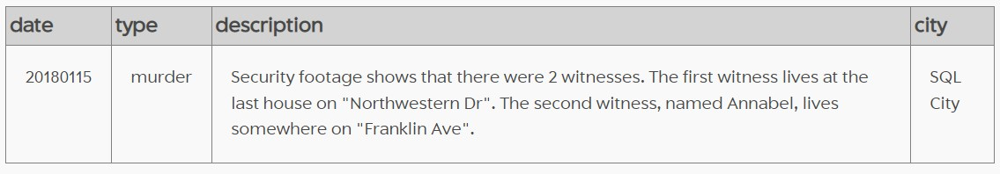

# SQL murder mystery

I have solved the SQL Murder Mystery presented by [knightlab] (https://mystery.knightlab.com/). This has been such a fun way if practising SQL queries, getting more comfortable with joins, and, last but not least, solving a mystery!

This is a walkthrough on how I solved the challenge:

We know that a murder took place in SQL City on 15th January 2018. Firstly, I had a look at the crime scene report for the specific time and place. This is how I got information about 2 people who witnessed the crime.

```SQL
SELECT * 
 FROM crime_scene_report
WHERE date = 20180115
 AND type = 'murder'
 AND city = 'SQL City';
 ```
 


 
